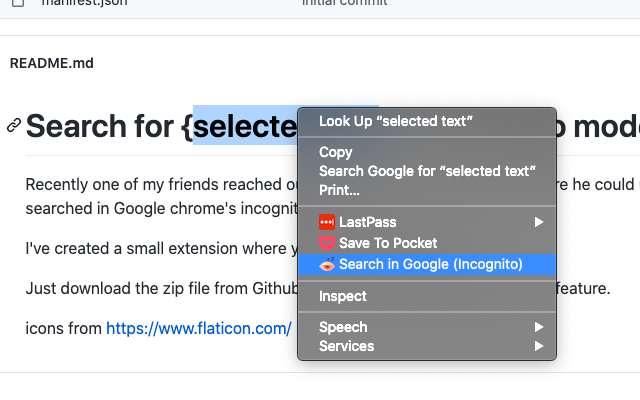

# Search for {selected text} in Incognito mode

Recently one of my friends reached out to me to create an extension
where he could use the selected text to be searched in Google chrome's
incognito mode.  

I've created a small extension where you could do exactly that.  

Just download the zip file from Github and use Load unpacked extension
feature.

Find the extension in Google Chrome store: https://chrome.google.com/webstore/detail/search-in-incognito/hiiafoidfbddfcnolnmklcdfoijddelf

icons from [https://www.flaticon.com/](https://www.flaticon.com/) 
